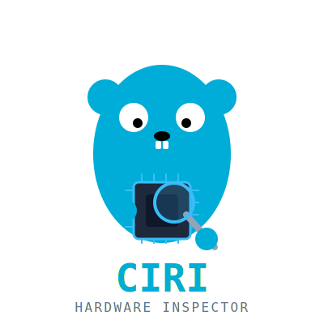

<p align="center">
  
</p>

<h1 align="center">ciri — Can I Run It?</h1>

<p align="center">
  A terminal tool that answers: <strong>which open-source LLMs can run on my machine, and how fast?</strong>
</p>

It detects your GPU, CPU, and RAM, then matches them against a catalog of 1,000+ models from Hugging Face. Instead of guessing whether an 8B model will fit in your VRAM, you get concrete numbers — estimated tokens per second, memory pressure, and whether the model fits comfortably or will spill into system RAM.

## Installation

**Go install** (requires Go 1.26+):

```sh
go install github.com/cezaryt5/ciri/cmd/ciri@latest
```

**Build from source:**

```sh
git clone https://github.com/cezaryt5/ciri
cd ciri
go build -o ciri ./cmd/ciri
```

All data files are embedded in the binary — no external files needed at runtime.

**Pre-built binary** is included in the repository (`ciri` in the project root).

## Usage

```sh
ciri
```

That's it. The tool starts an interactive terminal interface with four screens:

| Screen | What it shows |
|--------|---------------|
| **Home** | Category menu (Coding, Chat, General, Vision, Translation) with model counts |
| **Results** | All models for a category, sorted by fit quality and estimated speed |
| **Detail** | Full specs for a single model — parameters, quantization, RAM/VRAM/disk requirements, community stats |
| **Benchmarks** | Real-world tok/s measurements from benchmark data, matched to the closest available GPU |

### Keyboard controls

| Key | Action |
|-----|--------|
| `↑` `↓` / `j` `k` | Navigate lists |
| `Enter` / `Space` | Select / open |
| `b` | Open benchmarks for selected model |
| `Esc` | Go back |
| `q` / `Ctrl+C` | Quit |

## How it works

> For a deep dive into the system architecture, data flows, and every module, see [**docs/DOCUMENTAION.md**](docs/DOCUMENTAION.md).

### Hardware detection

On startup, `ciri` detects your hardware:

- **GPU** — identified through a three-tier matching strategy ([PCI device ID → vendor API like nvidia-smi or rocm-smi → fuzzy name matching](docs/DOCUMENTAION.md#5-gpu-matching-strategies)), cross-referenced against a database of 200+ GPUs with VRAM, bandwidth, and TFLOPS figures
- **CPU** — model name and core count via `ghw`
- **RAM** — total and available system memory
- **Toolchain** — checks whether `ollama` and `llama.cpp` are in your `$PATH`

Apple Silicon Macs are handled with unified memory accounting.

### Model catalog

1,000+ models sourced from Hugging Face, each with:

- Parameter count, quantization format, context length
- Min and recommended RAM/VRAM requirements
- Architecture family and pipeline type
- Community stats (downloads, likes)

Models are [auto-categorized](docs/DOCUMENTAION.md#6-model-catalog--categorization) into Coding, Chat, General, Vision, and Translation based on their listed capabilities.

### Fit assessment

Every model is checked against your hardware:

- **Recommended** — fits entirely in your VRAM (with a 10% buffer), will run at full speed
- **Advanced** — needs more VRAM than you have but fits in system RAM; will run, but slowly
- **Too heavy** — exceeds both VRAM *and* available system RAM; not shown

See [VRAM fit checking](docs/DOCUMENTAION.md#7-prediction-engine) for the exact logic.

### Speed estimation

Estimated tokens per second comes from a [three-tier cascade](docs/DOCUMENTAION.md#8-speed-estimation):

1. **Benchmark** — exact match from the benchmark cache (real measurements on similar hardware)
2. **Architecture scaling** — no exact match, but data exists for the same GPU architecture family
3. **Heuristic** — memory-bandwidth-bound or compute-bound estimation using the GPU's raw specs

If a model spills to system RAM, a 0.2x penalty is applied to the estimate.

## Data files

All data files are embedded in the binary at build time:

| Data | Contents |
|------|----------|
| GPU database | 200+ GPU profiles (VRAM, bandwidth, TFLOPS, PCI IDs, architecture family) |
| Model catalog | 1,000+ model entries scraped from Hugging Face |
| Benchmark cache | Real-world tok/s measurements indexed by GPU and model |

See [Data Files & Relationships](docs/DOCUMENTAION.md#2-data-files--relationships) for the full schema and how they connect.

## Platform support

| Platform | GPU detection | Status |
|----------|---------------|--------|
| Linux | nvidia-smi, rocm-smi, sysfs | Full support |
| macOS | system_profiler (Apple Silicon) | Full support |
| Windows | PowerShell / wmic | Partial |

## License

MIT — see [LICENSE](./LICENSE).
