# CIRI — Can I Run It? — System Documentation

> **Note:** The canonical name is `ciri`. The directory is `DOCUMENTAION.md` (historical typo retained).

## Table of Contents

1. [Architecture Overview](#1-architecture-overview)
2. [Data Files & Relationships](#2-data-files--relationships)
3. [GPU Database Loading & Normalization](#3-gpu-database-loading--normalization)
4. [Hardware Detection Flow](#4-hardware-detection-flow)
5. [GPU Matching Strategies](#5-gpu-matching-strategies)
6. [Model Catalog & Categorization](#6-model-catalog--categorization)
7. [Prediction Engine](#7-prediction-engine)
8. [Speed Estimation](#8-speed-estimation)
9. [TUI Components](#9-tui-components)
10. [Function Reference](#10-function-reference)

---

## 1. Architecture Overview

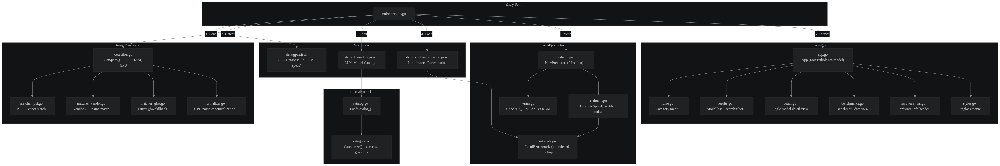

`ciri` is a terminal-based tool that answers: **which open-source LLMs can run on my machine, and how fast?**

The system is organised into four packages:

| Package | Path | Responsibility |
|---------|------|----------------|
| `main` | `cmd/ciri/` | Entry point, dependency wiring |
| `hardware` | `internal/hardware/` | GPU/CPU/RAM detection, GPU DB loading, GPU name matching |
| `model` | `internal/model/` | HF model catalog loading, category assignment |
| `predictor` | `internal/predictor/` | VRAM fit checking, speed estimation, prediction orchestration |
| `tui` | `internal/tui/` | Bubble Tea terminal UI (4 screens) |

### Startup sequence (`cmd/ciri/main.go`)

```
main()
  ├── Resolve data directory
  ├── LoadGPUDB("gpus.json")           → []hardware.GPU
  ├── GetSpecs(gpuDB)                  → hardware.DetectionResult
  │     ├── Specs.DetectCPU()          → CPU model, cores
  │     ├── Specs.DetectRAM()          → RAM total/avail (bytes + GB)
  │     ├── Specs.DetectOllamaCpp()    → ollama/llama.cpp on PATH?
  │     └── Specs.DetectGPU(gpuDB)     → GPU matching cascade
  ├── LoadCatalog("hf_models.json")    → []model.Model
  ├── LoadBenchmarks("benchmarks.json")→ *predictor.BenchmarkDB
  ├── NewPredictor(gpu, RAM, models, db) → *predictor.Predictor
  └── NewApp(specs, gpu, models, pred, db) → tea.Program (TUI)
```

---

## 2. Data Files & Relationships

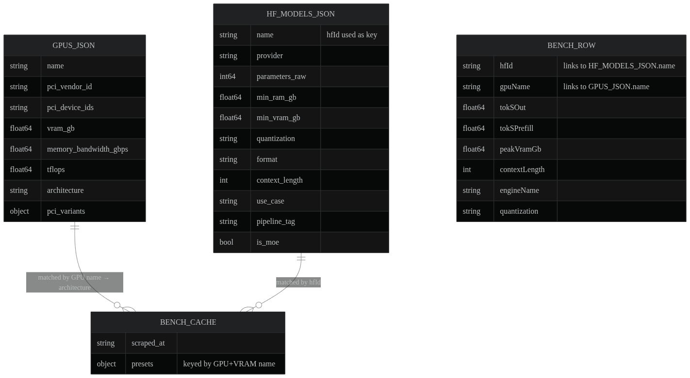

Three JSON data files in the `data/` directory are loaded at startup:

| File | Format | Loader | Purpose |
|------|--------|--------|---------|
| `gpus.json` | `[]gpuJSON` | `hardware.LoadGPUDB()` | GPU specs: VRAM, bandwidth, TFLOPS, PCI IDs, architecture, aliases |
| `hf_models.json` | `[]Model` | `model.LoadCatalog()` | 1000+ HF models with params, quant, RAM/VRAM reqs, categories |
| `benchmark_cache.json` | `benchmarkCacheFile` | `predictor.LoadBenchmarks()` | Real-world tok/s measurements indexed by GPU + model |

### Data flow

```
GPUs.csv ──┐
           ├──► merge_gpus.py ──► gpus.json ──► LoadGPUDB() ──► []GPU
pci.ids  ──┘
                                   
hf_models.json ────────────────────► LoadCatalog() ──► []Model (with Categories)

benchmark_cache.json ──────────────► LoadBenchmarks() ──► BenchmarkDB
                                        ├── byNameHfID: "gpuName|hfId" → []Row
                                        └── byArchHfID: "arch|hfId"    → []Row
```

---

## 3. GPU Database Loading & Normalization

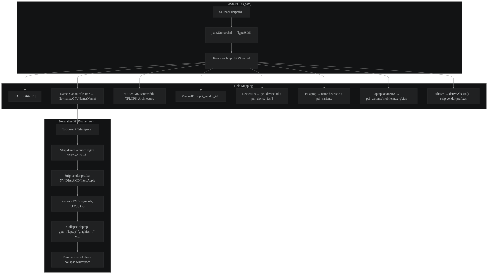

### `LoadGPUDB()` — `internal/hardware/detection.go:194`

**Callers:** `cmd/ciri/main.go:29`, `detection_test.go:47,97,108,141,181`

Reads `gpus.json` and converts each `gpuJSON` entry into an internal `GPU` struct:

1. **Identity:** assigns a sequential `ID`, copies `Name`
2. **Normalization:** calls `NormalizeGPUName(r.Name)` to produce `CanonicalName`
3. **PCI IDs:** collects `VendorID`, deduplicates `DeviceIDs` from `pci_device_id` and `pci_device_ids`
4. **Laptop detection:** flags `IsLaptop` if name contains "laptop"/"mobile", or PCI variant key is "mobile"/"max_q"
5. **Aliases:** calls `deriveAliases(r.Name)` to generate vendor-stripped short names
6. **Specs:** copies `VRAMGB`, `Bandwidth`, `TFLOPS`, `Architecture` when present

### `NormalizeGPUName()` — `internal/hardware/normalizer.go:32`

**Callers:** `detection.go:210`, `matcher_ghw.go:27`, `matcher_vendor.go:35,140`, tests

Transforms raw marketing names into canonical searchable form:

```
"NVIDIA GeForce RTX 4090"              → "rtx 4090"
"AMD Radeon (TM) RX 7900 XTX"         → "rx 7900 xtx"
"Intel(R) Arc(TM) A770 Graphics"      → "arc a770"
"NVIDIA GeForce RTX 3080 Laptop GPU"  → "rtx 3080 laptop"
```

Steps: lowercase → strip driver versions → strip vendor prefixes → remove `(tm)`/`(r)` → remove "graphics"/"gpu" → replace "mobile" with "laptop" → remove special chars → collapse whitespace.

### `deriveAliases()` — `internal/hardware/detection.go:263`

Strips vendor prefixes (e.g. "nvidia geforce rtx ", "amd radeon rx ") to produce alias strings for broader matching. Only strips the longest matching prefix.

---

## 4. Hardware Detection Flow

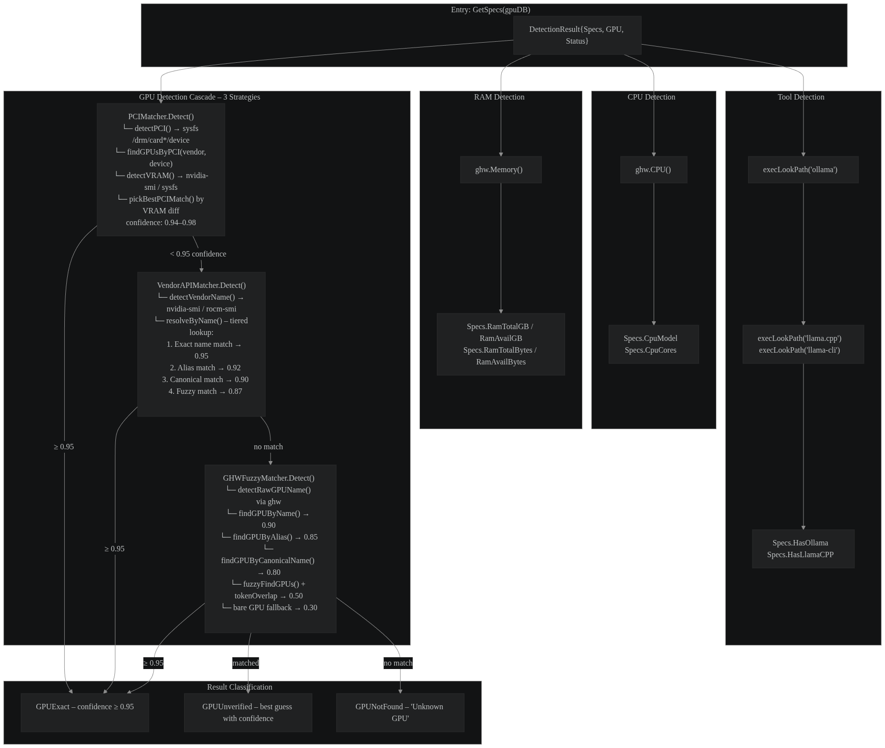

### `GetSpecs()` — `internal/hardware/detection.go:75`

**Callers:** `cmd/ciri/main.go:36`

Entry point for all hardware detection. Orchestrates four steps:

```
GetSpecs(gpuDB)
  ├── Specs.DetectCPU()       → CpuModel, CpuCores
  ├── Specs.DetectRAM()       → RamTotalGB, RamAvailGB, RamTotalBytes, RamAvailBytes
  ├── Specs.DetectOllamaCpp() → HasOllama, HasLlamaCPP
  └── Specs.DetectGPU(gpuDB)  → GPU matching cascade
```

### `DetectCPU()` — `detection.go:95`

Uses `ghw.CPU()` to get model name and total core count. Falls back to "Unknown" on permission errors.

### `DetectRAM()` — `detection.go:110`

Uses `ghw.Memory()` to get total and usable physical bytes. Stores both float64 (GB for display) and uint64 (bytes for offloading math).

### `DetectOllamaCpp()` — `detection.go:125`

Checks PATH for `ollama`, `llama.cpp`, `llama-cli`, `llama-server` via `execLookPath()`.

---

## 5. GPU Matching Strategies

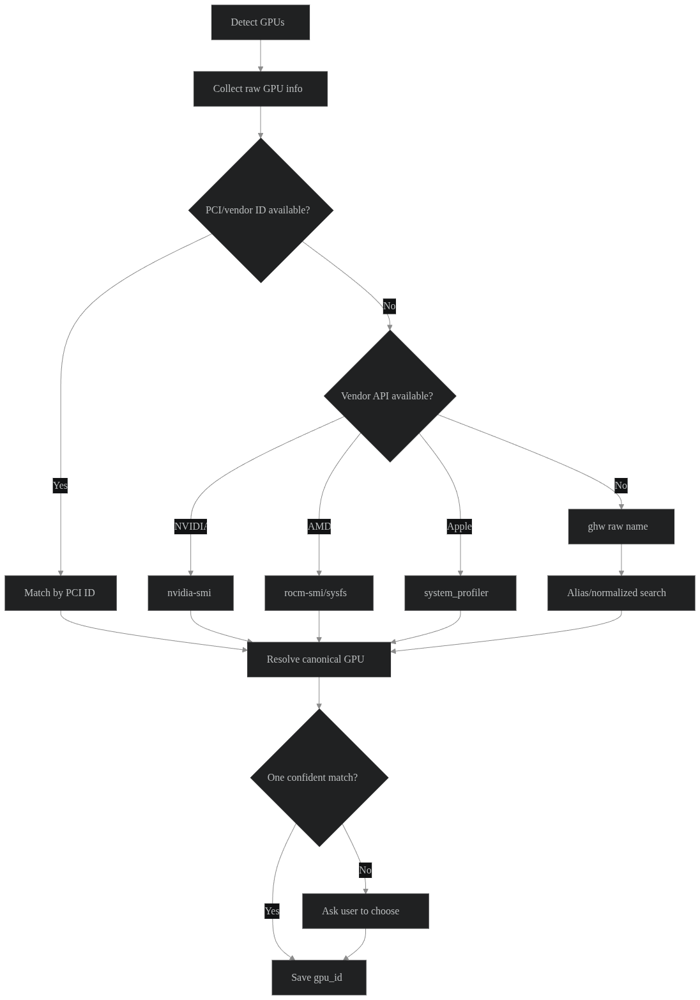

The heart of the system: a three-strategy cascade with confidence scoring.

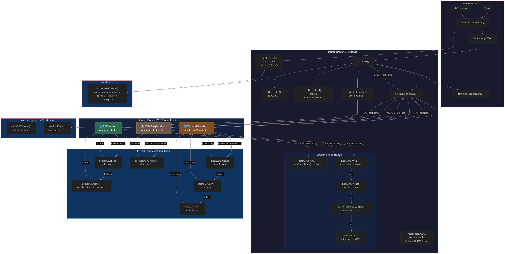

### `DetectGPU()` — `internal/hardware/detection.go:135`

**Callers:** `detection.go:87`, `detection_test.go:407,430`

Tries three matchers in order. If any reaches **≥0.95 confidence**, returns immediately. Otherwise keeps the best guess.

```go
strategies := []GPUMatcher{
    &PCIMatcher{},       // highest confidence (0.94-0.98)
    &VendorAPIMatcher{}, // medium confidence  (0.80-0.95)
    &GHWFuzzyMatcher{},  // lowest confidence  (0.30-0.90)
}
```

### 5.1 PCIMatcher — `internal/hardware/matcher_pci.go:9`

**Callers:** `detection.go:147` (via interface)

Uses PCI vendor/device IDs for exact hardware match.

```
Detect()
  ├── detectPCI(ctx)              → platform-specific PCI scan
  │     ├── Linux:   /sys/class/drm/card*/device (vendor + device files)
  │     ├── macOS:   returns nil (no sysfs)
  │     └── Windows: PowerShell Get-PnpDevice / wmic
  ├── findGPUsByPCI(db, vendorID, deviceID)  → []*GPU (may be multiple variants)
  ├── detectVRAM(ctx, pci)                   → float64 GiB
  │     ├── Linux NVIDIA:  nvidia-smi
  │     ├── Linux AMD:     sysfs mem_info_vram_total
  │     └── Windows NVIDIA: nvidia-smi
  └── pickBestPCIMatch(matches, vram) → *GPU
        ├── VRAM detected? → pick closest VRAM match
        └── No VRAM?       → prefer desktop over laptop
```

Confidence: `0.98` (single match), `0.96` (multi match + VRAM tiebreak), `0.94` (ambiguous).

### 5.2 VendorAPIMatcher — `internal/hardware/matcher_vendor.go:12`

**Callers:** `detection.go:147` (via interface)

Queries vendor CLI tools for the GPU marketing name.

```
Detect()
  ├── detectPCI(ctx)              → PCIInfo (vendor ID)
  ├── detectVendorName(ctx, pci)  → string
  │     ├── NVIDIA: nvidiaSMIQuery() → nvidia-smi --query-gpu=name
  │     ├── AMD:    rocmSMIQuery()   → rocm-smi --showproductname --json
  │     └── macOS:  system_profiler SPDisplaysDataType → "Chipset Model"
  └── resolveByName(db, name, 0.95)
```

`resolveByName()` tries four match types with decreasing confidence:

| Step | Lookup | Confidence |
|------|--------|------------|
| 1 | `findGPUByName()` — exact marketing name | baseConf (0.95) |
| 2 | `findGPUByAlias()` — vendor-stripped alias | baseConf - 0.03 |
| 3 | `findGPUByCanonicalName()` — normalized name | baseConf - 0.05 |
| 4 | `fuzzyFindGPUs()` — substring + token overlap | baseConf - 0.08 to -0.15 |

### 5.3 GHWFuzzyMatcher — `internal/hardware/matcher_ghw.go:10`

**Callers:** `detection.go:147` (via interface)

Lowest-confidence strategy. Uses the `ghw` library directly.

```
Detect()
  ├── detectRawGPUName() → string (filters iGPUs: Intel HD/UHD/Iris, non-RX Radeon)
  ├── findGPUByName()    → 0.90
  ├── findGPUByAlias()   → 0.85
  ├── findGPUByCanonicalName() → 0.80
  ├── fuzzyFindGPUs() + tokenOverlapScore() → 0.50-0.70
  └── bare GPU with detected name → 0.30 (always returns something)
```

### Platform-specific detection

| Function | File | Line | Linux | macOS | Windows |
|----------|------|------|-------|-------|---------|
| `detectPCI` | `detection_linux.go:21` / `_darwin.go:15` / `tools_windows.go:15` | sysfs scan | nil | PnP/WMI |
| `detectVRAM` | `detection_linux.go:81` / `_darwin.go:20` / `tools_windows.go:55` | nvidia-smi/sysfs | 0 | nvidia-smi |
| `detectVendorName` | `detection_linux.go:113` / `_darwin.go:25` | nvidia-smi/rocm-smi | system_profiler | — |
| `detectRawGPUName` | `detection_linux.go:166` / `_darwin.go:50` | ghw (iGPU filter) | ghw | — |
| `execWithTimeout` | `tools_unix.go:12` / `tools_windows.go:75` | context+exec | — | context+exec |
| `execLookPath` | `tools_unix.go:19` | exec.LookPath | — | — |

---

## 6. Model Catalog & Categorization

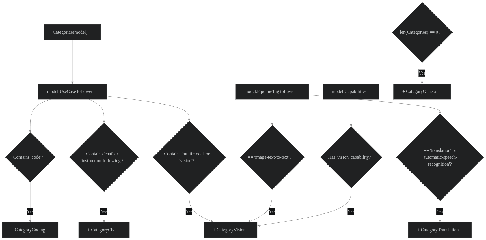

### `LoadCatalog()` — `internal/model/catalog.go:35`

**Callers:** `cmd/ciri/main.go:44`, tests

Reads `hf_models.json`, unmarshals into `[]Model`, and calls `Categorize()` on each.

### `Categorize()` — `internal/model/category.go:30`

**Callers:** `catalog.go:47`, tests

Classifies models into categories based on `UseCase`, `Capabilities`, and `PipelineTag`:

```
Categorize(m)
  ├── UseCase contains "code"                   → CategoryCoding
  ├── UseCase contains "chat"/"instruction"      → CategoryChat
  ├── hasCapability("vision") / pipeline match   → CategoryVision
  ├── pipeline == "translation"/"asr"            → CategoryTranslation
  └── fallback (no match)                       → CategoryGeneral
```

A model can belong to **multiple** categories (e.g. vision-capable chat model).

### Category constants

| Category | Value | Example models |
|----------|-------|----------------|
| `CategoryCoding` | "Coding" | CodeLlama, DeepSeek-Coder |
| `CategoryChat` | "Chat" | Llama-3, Mistral |
| `CategoryGeneral` | "General" | Text-generation fallback |
| `CategoryVision` | "Vision" | LLaVA, llava-v1.6 |
| `CategoryTranslation` | "Translation" | NLLB, Whisper |

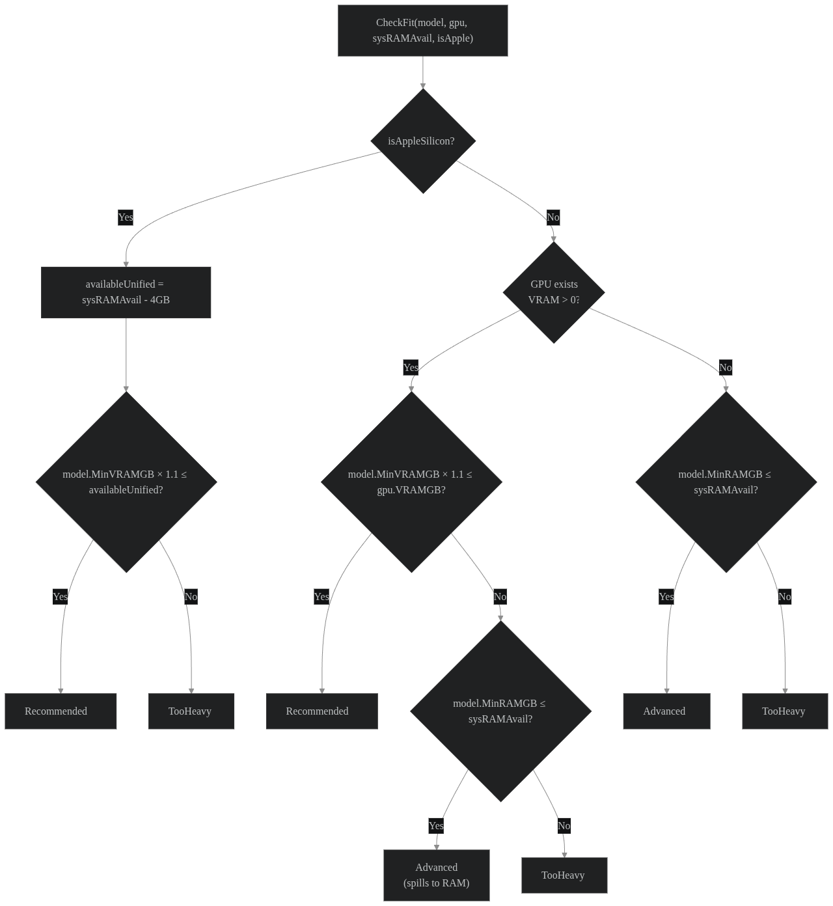

---

## 7. Prediction Engine

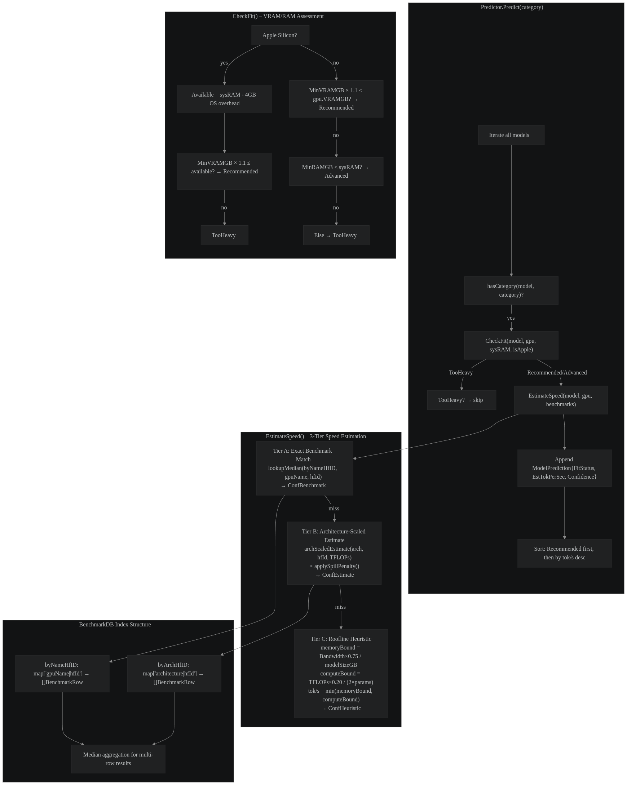

### `Predictor` — `internal/predictor/predictor.go:13`

The orchestrator that ties hardware, models, and benchmarks together.

### `NewPredictor()` — `predictor.go:30`

**Callers:** `cmd/ciri/main.go:57`, tests

Creates a `Predictor` bound to the detected GPU, available system RAM, model catalog, and benchmark database. Automatically detects Apple Silicon by checking GPU name/architecture/vendor ID (`106b`).

### `Predict()` — `predictor.go:47`

**Callers:** `results.go:55`, tests

The main prediction loop:

```
Predict(category)
  for each model in catalog:
    if model not in category → skip
    fit := CheckFit(model, gpu, sysRAM, isApple)
    if fit == TooHeavy → skip (not shown to user)
    tok/s, confidence := EstimateSpeed(model, gpu, benchmarks)
    append to results
  sort: Recommended first (by tok/s desc), then Advanced
  return results
```

### `CountByCategory()` — `predictor.go:83`

**Callers:** `app.go:50`, tests

Counts fitting models (Recommended + Advanced) per category for the home screen menu display.

### `CheckFit()` — `internal/predictor/vram.go:36`

**Callers:** `predictor.go:56,91`, tests

Determines whether a model fits:

| Condition | Result |
|-----------|--------|
| Apple Silicon: `MinVRAMGB × 1.1 ≤ (sysRAM - 4GB)` | Recommended |
| Apple Silicon: otherwise | TooHeavy |
| dGPU: `MinVRAMGB × 1.1 ≤ GPU.VRAMGB` | Recommended |
| dGPU: `MinRAMGB ≤ sysRAMAvail` | Advanced (spills to RAM) |
| dGPU: otherwise | TooHeavy |

---

## 8. Speed Estimation

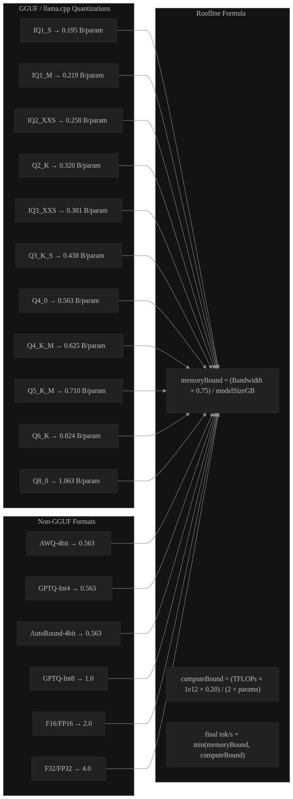

### `EstimateSpeed()` — `internal/predictor/estimate.go:263`

**Callers:** `predictor.go:61`, tests

Three-tier cascade returning `(tokPerSec, confidenceLabel)`:

```
Tier A: Exact benchmark match
  ├── lookupMedian(byNameHfID, canonical|hfID)  → tok/s | "Benchmark"
  └── lookupMedian(byNameHfID, gpuName|hfID)    → tok/s | "Benchmark"

Tier B: Architecture-family scaling
  └── archScaledEstimate(arch, hfID, TFLOPS, db) → median tok/s | "Estimate"
        └── applySpillPenalty(scaled, gpu, model) ← ×0.2 if model > VRAM

Tier C: Roofline heuristic
  ├── memoryBound = (Bandwidth × 0.75) / modelSizeGB
  ├── computeBound = (TFLOPS × 1e12 × 0.20) / (2 × params)
  └── tok/s = min(memoryBound, computeBound) | "Heuristic"
        └── ×0.2 if model > VRAM
```

### Key constants

| Constant | Value | Meaning |
|----------|-------|---------|
| `modelFLOPUtilization` | 0.20 | Decode FLOP utilisation |
| `flopsPerParamPerToken` | 2.0 | One multiply-add per param per token |
| `vramBufferFactor` | 1.1 | 10% VRAM headroom |
| `appleOSOverhead` | 4.0 GB | macOS unified memory reserved by OS |

### `GetMemoryEfficiency()` — `estimate.go:195`

Resolves bandwidth utilisation dynamically from the GPU architecture string (e.g.
`"ada lovelace"` → 0.80, `"pascal"` → 0.50, `"apple m4"` → 0.75). Falls back
to 0.60 for unrecognised architectures, or 0.45 for system RAM. Replaces the
old hardcoded `memoryEfficiency` constant.

### `BytesPerParam()` — `estimate.go:331`

Maps quantization tags to bytes-per-parameter (e.g. `Q4_K_M` → 0.625, `FP16` → 2.0). Defaults to 2.0 for unknown quants.

### `lookupMedian()` — `estimate.go:362`

Looks up benchmark rows by composite key and returns median tok/s.

### `archScaledEstimate()` — `estimate.go:380`

Returns median benchmark tok/s for an architecture family (e.g. "ada lovelace", "rdna 3").

### `median()` / `sortFloat64()` — `estimate.go:409,423`

Computes median of benchmark values using an insertion sort (small N).

---

## 9. TUI Components

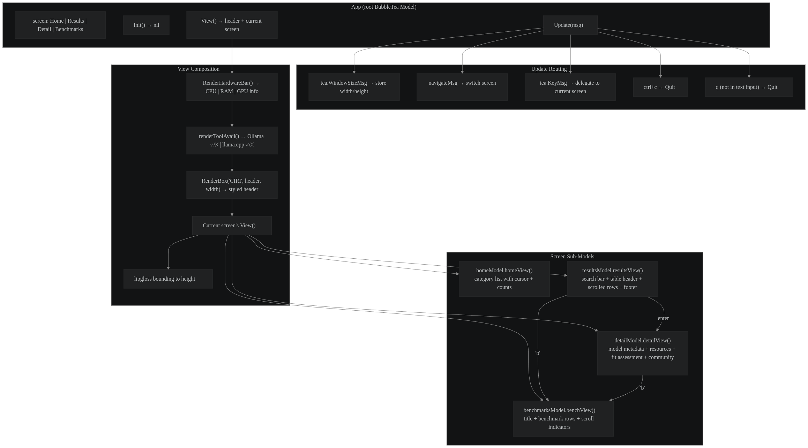

The terminal UI uses [Bubble Tea](https://github.com/charmbracelet/bubbletea) (the Go Elm architecture) with [Lipgloss](https://github.com/charmbracelet/lipgloss) for styling.

### Root model: `App` — `internal/tui/app.go:30`

Manages four screens via a `screen` enum:

| Screen | Model | File | Purpose |
|--------|-------|------|---------|
| `screenHome` | `homeModel` | `home.go` | Category menu with model counts |
| `screenResults` | `resultsModel` | `results.go` | Filterable/sortable model table |
| `screenDetail` | `detailModel` | `detail.go` | Full model specs & fit assessment |
| `screenBenchmarks` | `benchmarksModel` | `benchmarks.go` | Benchmark rows for selected model |

### Screen flow

```
Home ──Enter──► Results ──Enter──► Detail ──b──► Benchmarks
  ▲               │                                  │
  └─────Esc───────┘               ◄──────Esc─────────┘
```

### Hardware bar — `hardware_bar.go:11`

Always-visible status line showing: `CPU | RAM avail/total | GPU name + VRAM`

### Results screen features

- **Search:** press `/` to filter models by name/provider/quant/params
- **Fit filter:** press `F` to cycle All → Perfect → Good → Slow
- **Sort:** press `S` to cycle Default → Speed → Size → Name
- **Scroll indicators:** "↑ N above" / "↓ N more"
- **Colored cells:** memory percentage (green < 50%, yellow ≤ 80%, red > 80%)
- **Fit dots:** green ● = Recommended, yellow ● = Advanced

### Detail screen

Shows: model name, provider, parameters, quantization, format, context length, architecture, pipeline, resource requirements (min RAM, recommended RAM, min VRAM), fit assessment with colored status, estimated speed, VRAM usage %, and community stats (downloads, likes).

### Benchmarks screen

Shows real-world tok/s measurements from the benchmark database for the closest hardware match. Each row displays engine name, tok/s, peak VRAM, context length, and notes.

---

## 10. Function Reference

Every function with its file location, callers, and purpose is documented as a Go doc comment in the source code. Below is a summary index.

### Package `main` — `cmd/ciri/main.go`

| Function | Line | Callers | Purpose |
|----------|------|---------|---------|
| `main` | 16 | Go runtime | Entry point; wires dependencies and starts TUI |

### Package `hardware` — `internal/hardware/`

#### `detection.go`

| Function | Line | Callers | Purpose |
|----------|------|---------|---------|
| `GetSpecs` | 75 | `main.go:36` | Orchestrates CPU/RAM/tools/GPU detection |
| `DetectCPU` | 95 | `detection.go:78` | Detects CPU model and cores via ghw |
| `DetectRAM` | 110 | `detection.go:81` | Detects total/available RAM via ghw |
| `DetectOllamaCpp` | 125 | `detection.go:85` | Checks PATH for ollama/llama.cpp |
| `DetectGPU` | 135 | `detection.go:87` | 3-strategy GPU matching cascade |
| `LoadGPUDB` | 194 | `main.go:29` | Loads & normalises gpus.json |
| `deriveAliases` | 263 | `detection.go:257` | Strips vendor prefixes for alias matching |
| `findGPUsByPCI` | 289 | `matcher_pci.go:15` | Searches GPU DB by PCI vendor/device ID |
| `pickBestPCIMatch` | 306 | `matcher_pci.go:21` | Disambiguates multiple PCI matches |
| `abs` | 335 | `detection.go:316,318` | Float absolute value helper |

#### `detection_linux.go` (build tag: `linux`)

| Function | Line | Callers | Purpose |
|----------|------|---------|---------|
| `detectPCI` | 21 | `matcher_pci.go:10`, `matcher_vendor.go:13` | Scans sysfs for PCI devices |
| `readHexFile` | 68 | `detection_linux.go:31-32` | Reads hex value from sysfs file |
| `detectVRAM` | 81 | `matcher_pci.go:20` | Detects VRAM via nvidia-smi or sysfs |
| `detectVendorName` | 113 | `matcher_vendor.go:14` | Queries nvidia-smi/rocm-smi for GPU name |
| `nvidiaSMIQuery` | 133 | `detection_linux.go:119` | Runs nvidia-smi --query-gpu=name |
| `rocmSMIQuery` | 142 | `detection_linux.go:125` | Runs rocm-smi --showproductname --json |
| `detectRawGPUName` | 166 | `matcher_ghw.go:11` | Gets GPU name from ghw, filtering iGPUs |

#### `detection_darwin.go` (build tag: `darwin`)

| Function | Line | Callers | Purpose |
|----------|------|---------|---------|
| `detectPCI` | 15 | `matcher_pci.go:10`, `matcher_vendor.go:13` | macOS stub — returns nil |
| `detectVRAM` | 20 | `matcher_pci.go:20` | macOS stub — returns 0 |
| `detectVendorName` | 25 | `matcher_vendor.go:14` | Uses system_profiler for chipset model |
| `glxinfoQuery` | 45 | (unused) | macOS stub — returns "" |
| `detectRawGPUName` | 50 | `matcher_ghw.go:11` | Uses ghw as fallback on macOS |

#### `tools_unix.go` / `tools_windows.go`

| Function | Line | Callers | Purpose |
|----------|------|---------|---------|
| `execWithTimeout` (unix) | 12 | `detection_linux.go:88,134,144`, `detection_darwin.go:29` | Runs command with deadline |
| `execLookPath` (unix) | 19 | `detection.go:126,128,129` | Checks PATH for executable |
| `detectPCI` (win) | 15 | `matcher_pci.go:10`, `matcher_vendor.go:13` | Queries Windows PnP device IDs |
| `parseWindowsPnP` (win) | 34 | `tools_windows.go:20,31` | Parses PCI IDs from PnP string |
| `detectVRAM` (win) | 55 | `matcher_pci.go:20` | Windows VRAM via nvidia-smi |
| `execWithTimeout` (win) | 75 | `tools_windows.go:17,26,62` | Windows exec with deadline |

#### `normalizer.go`

| Function | Line | Callers | Purpose |
|----------|------|---------|---------|
| `NormalizeGPUName` | 32 | `detection.go:210`, `matcher_ghw.go:27`, `matcher_vendor.go:35,140` | Converts raw name to canonical form |

#### `matcher_pci.go`

| Function | Line | Callers | Purpose |
|----------|------|---------|---------|
| `PCIMatcher.Detect` | 9 | `detection.go:147` | PCI vendor/device ID matching (confidence 0.94-0.98) |

#### `matcher_vendor.go`

| Function | Line | Callers | Purpose |
|----------|------|---------|---------|
| `VendorAPIMatcher.Detect` | 12 | `detection.go:147` | Vendor CLI name matching |
| `resolveByName` | 23 | `matcher_vendor.go:18` | Tiered name resolution with decreasing confidence |
| `findGPUByName` | 53 | `matcher_ghw.go:17`, `matcher_vendor.go:25` | Exact marketing name match |
| `findGPUByAlias` | 64 | `matcher_ghw.go:22`, `matcher_vendor.go:30` | Alias match |
| `findGPUByCanonicalName` | 77 | `matcher_ghw.go:28`, `matcher_vendor.go:36` | Canonical name match |
| `fuzzyFindGPUs` | 88 | `matcher_ghw.go:33`, `matcher_vendor.go:41` | Substring + prefix match |
| `tokenOverlapScore` | 116 | `matcher_ghw.go:40,42` | Token-based fuzzy ranking |
| `tokenizeGPUName` | 139 | `matcher_vendor.go:117-118` | Splits name into tokens (≥2 chars) |

#### `matcher_ghw.go`

| Function | Line | Callers | Purpose |
|----------|------|---------|---------|
| `GHWFuzzyMatcher.Detect` | 10 | `detection.go:147` | Fuzzy name matching via ghw (confidence 0.30-0.90) |

### Package `model` — `internal/model/`

| Function | Line | Callers | Purpose |
|----------|------|---------|---------|
| `LoadCatalog` | 35 | `main.go:44` | Loads hf_models.json and categorises |
| `AllCategories` | 17 | `predictor.go:85`, `home.go:25,29,45` | Returns 5 categories in display order |
| `Categorize` | 30 | `catalog.go:47` | Assigns categories from UseCase/Capabilities |
| `hasCapability` | 55 | `category.go:40` | Checks if model has a capability |

### Package `predictor` — `internal/predictor/`

#### `predictor.go`

| Function | Line | Callers | Purpose |
|----------|------|---------|---------|
| `NewPredictor` | 30 | `main.go:57` | Creates Predictor, detects Apple Silicon |
| `Predict` | 47 | `results.go:55` | Returns sorted model predictions for category |
| `CountByCategory` | 83 | `app.go:50` | Counts fitting models per category |
| `hasCategory` | 100 | `predictor.go:52,88` | Checks model category membership |

#### `vram.go`

| Function | Line | Callers | Purpose |
|----------|------|---------|---------|
| `FitStatus.String` | 17 | fmt.Stringer | Human-readable fit status |
| `CheckFit` | 36 | `predictor.go:56,91` | Determines Recommended/Advanced/TooHeavy |

#### `estimate.go`

| Function | Line | Callers | Purpose |
|----------|------|---------|---------|
| `LoadBenchmarks` | 81 | `main.go:51` | Loads benchmark_cache.json, builds indices |
| `ByNameHfID` | 147 | `benchmarks.go:31` | Returns byNameHfID index |
| `extractGPUName` | 153 | `estimate.go:105` | Strips VRAM suffix from preset name |
| `EstimateSpeed` | 263 | `predictor.go:61` | 3-tier speed estimation |
| `BytesPerParam` | 325 | `estimate.go:295,354`, `results.go:539` | Returns bytes/param for quant |
| `computeBoundEstimate` | 343 | `estimate.go:302` | Arithmetic throughput cap |
| `applySpillPenalty` | 353 | `estimate.go:286` | ×0.2 penalty if model > VRAM |
| `lookupMedian` | 362 | `estimate.go:274,277` | Median benchmark lookups |
| `archScaledEstimate` | 380 | `estimate.go:285` | Architecture-family median |
| `median` | 409 | `estimate.go:377,397` | Float64 median |
| `sortFloat64` | 423 | `estimate.go:416` | Insertion sort |
| `archFactor` | 431 | test | tok/s-per-TFLOP factor lookup |

### Package `tui` — `internal/tui/`

#### `app.go`

| Function | Line | Callers | Purpose |
|----------|------|---------|---------|
| `NewApp` | 49 | `main.go:60` | Creates root App model |
| `Init` | 63 | Bubble Tea | Lifecycle — returns nil |
| `Update` | 67 | Bubble Tea | Routes messages to active screen |
| `View` | 113 | Bubble Tea | Renders hardware bar + screen content |
| `isTextInput` | 154 | `app.go:93` | True if capturing search text |
| `label` | 158 | `app.go:124,130,135,141` | Current screen title |
| `renderToolAvail` | 178 | `app.go:116` | Renders ollama/llama.cpp checkmarks |

#### `home.go`

| Function | Line | Callers | Purpose |
|----------|------|---------|---------|
| `homeUpdate` | 16 | `app.go:97` | Category navigation & selection |
| `homeView` | 40 | `app.go:130` | Renders category menu with counts |

#### `results.go`

| Function | Line | Callers | Purpose |
|----------|------|---------|---------|
| `newResultsModel` | 53 | `app.go:122` | Creates results model |
| `applyFilters` | 66 | `results.go:60,135,139,143,146,160,168,171` | Filters and sorts predictions |
| `resultsUpdate` | 126 | `app.go:100` | Keyboard input handling |
| `resultsView` | 218 | `app.go:124` | Renders results table |
| `searchBar` | 270 | `results.go:224` | Renders search/filter controls |
| `renderMiniBox` | 296 | `results.go:282-286` | Rounded control box |
| `fitFilterLabel` | 313 | `results.go:285` | Fit filter display name |
| `sortModeLabel` | 326 | `results.go:284` | Sort mode display name |
| `resultsPreview` | 339 | `app.go:126` | Selected model preview bar |
| `resultsFooter` | 347 | `app.go:128` | Keyboard shortcut help |
| `visibleRows` | 354 | `results.go:183,236` | Visible table rows count |
| `columnWidths` | 378 | `results.go:219` | Dynamic column widths |
| `renderTableHeader` | 399 | `results.go:227` | Column headers |
| `renderTableRow` | 416 | `results.go:253` | Single prediction row |
| `padCell` | 484 | `results.go:401-412` | Fixed-width cell padding |
| `fitDotStr` | 491 | `results.go:439` | Colored fit status dot |
| `fitLabel` | 502 | `results.go:440` | Colored fit status text |
| `fitLabelPlain` | 513 | `results.go:443` | Uncolored fit status text |
| `formatMemPctRaw` | 524 | `results.go:422` | VRAM usage percentage |
| `formatDiskGB` | 535 | `results.go:463` | Model disk footprint |
| `formatMode` | 547 | `results.go:464` | "GPU" vs "CPU" label |
| `formatDate` | 554 | `results.go:467` | Date to YYYY-MM |
| `truncate` | 561 | `app.go:166,171`, `results.go:458-467`, `styles.go:112`, `benchmarks.go:70,120`, `detail.go:43` | String truncation with ellipsis |

#### `detail.go`

| Function | Line | Callers | Purpose |
|----------|------|---------|---------|
| `newDetailModel` | 21 | `app.go:133` | Creates detail model |
| `detailUpdate` | 29 | `app.go:103` | Esc/B key handling |
| `detailView` | 39 | `app.go:135` | Full model detail rendering |
| `detailRow` | 83 | `detail.go:47-77` | Label-value row |
| `formatContext` | 87 | `detail.go:52`, `benchmarks.go:113`, `results.go:466` | Context length formatting |
| `formatNum` | 97 | `detail.go:76-77` | Large number formatting |

#### `benchmarks.go`

| Function | Line | Callers | Purpose |
|----------|------|---------|---------|
| `newBenchmarksModel` | 23 | `app.go:83,138` | Creates benchmarks model |
| `benchUpdate` | 47 | `app.go:106` | Scroll and back navigation |
| `benchView` | 67 | `app.go:141` | Benchmark table rendering |
| `bmVisibleRows` | 141 | `benchmarks.go:85` | Visible benchmark rows count |

#### `hardware_bar.go`

| Function | Line | Callers | Purpose |
|----------|------|---------|---------|
| `RenderHardwareBar` | 11 | `app.go:116` | CPU/RAM/GPU status bar |

#### `styles.go`

| Function | Line | Callers | Purpose |
|----------|------|---------|---------|
| `RenderLabeledLine` | 83 | (uncalled) | Section divider with label |
| `RenderDivider` | 95 | `results.go:228`, `benchmarks.go:98` | Horizontal divider |
| `RenderBox` | 102 | `app.go:117,124,130,135,141` | Bordered box with title |
| `repeat` | 136 | `styles.go:89,92,99,119,130`, `results.go:290` | String repetition |
